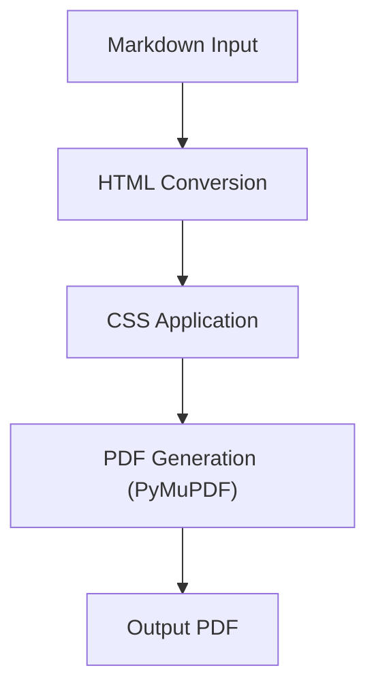

# Markdown to PDF Converter

A Python tool to convert Markdown files to PDF with advanced styling, including CSS-driven theming, headers/footers, page numbering, and Mermaid.js diagram conversion. This tool is specifically designed for **document as code** and **diagram as code** users, aiming for compatibility with document repositories and platforms like Confluence.

## Features

- Convert Markdown to PDF
- CSS-driven styling
- Custom headers and footers with page numbering
- Automatic Table of Contents generation: Generates a clickable Table of Contents with indentation per header level, placed on an independent page with a "Table of Content" title.
- Code syntax highlighting with Confluence-like titles and line numbers
- Mermaid.js diagram conversion to images

## How it Works

The `markdown-to-pdf` tool processes your Markdown input through several key stages to generate the final PDF document:



1.  **Markdown Input**: Your Markdown content is taken as input.
2.  **HTML Conversion**:
    *   The Markdown content is converted into HTML.
    *   **Mermaid.js to Image**: Any `mermaid` code blocks are detected and rendered into PNG images, which are then embedded into the HTML.
    *   **Table of Contents**: A clickable Table of Contents is generated and prepended to the main document HTML.
    *   **Code Block Styling**: Code blocks are processed to support Confluence-like titles and line numbers.
3.  **CSS Application**: User-provided and default CSS rules are applied to style the generated HTML.
4.  **PDF Generation**: The styled HTML document is then rendered into a high-quality PDF using PyMuPDF.

## Why HTML and PyMuPDF?

This tool leverages HTML and CSS as an intermediate step for several key reasons:

*   **Rich Styling and Layout**: Markdown is excellent for content structure but lacks robust styling capabilities. By converting to HTML, we can utilize the full power of CSS to control fonts, colors, spacing, margins, and complex page layouts. This allows for highly customizable and professional-looking PDF outputs, far beyond what direct Markdown-to-PDF converters can typically achieve.
*   **Advanced Features Integration**: Many advanced document features, such as syntax highlighting (Pygments), dynamic Table of Contents generation, and embedding complex diagrams (like Mermaid.js, which renders to images), are natively supported and easily manipulated within the HTML and CSS ecosystem.
*   **PyMuPDF for High-Quality PDF**: PyMuPDF is a powerful and flexible Python library that excels at rendering HTML and CSS into high-quality PDF documents. It provides:
    *   **Excellent HTML/CSS Rendering**: PyMuPDF's 'Story' feature and `insert_htmlbox` method allow for direct rendering of HTML content with CSS styling, enabling precise control over layout, fonts, and other visual elements.
    *   **Python Native Integration**: As a Python library, it integrates seamlessly into our project, offering a programmatic and reliable way to generate PDFs without relying on external, less controllable command-line tools for the core rendering process.
    *   **Minimal Dependencies**: PyMuPDF is a self-contained library with minimal external dependencies, making it easy to install and deploy.

## Installation

```bash
pip install md-export-pdf
```

**Note:** For Mermaid.js diagram conversion, you also need to install `mermaid.cli` (mmdc) via npm:
```bash
npm install -g @mermaid-js/mermaid-cli
```

## Usage

```bash
md-export-pdf <input_file.md> -o <output_file.pdf> -s <style.css> \
  [--header "My Document" | --header-file <header.md/html>] [--header-css <header.css>] \
  [--footer "Page {page_num} of {total_pages}" | --footer-file <footer.md/html>] [--footer-css <footer.css>] \
  [--cover-page <cover_page.md>] [--cover-css <cover.css>] \
  [--use-pymupdf-header] [--use-pymupdf-footer]
```

**Note on Headers/Footers:** By default, WeasyPrint handles header and footer generation. If `--use-pymupdf-header` and/or `--use-pymupdf-footer` are used, PyMuPDF will be used for the respective element(s). When using PyMuPDF, only plain text content is supported; Markdown formatting will not be rendered.


## Pluggable PDF Post-processing

This project implements a pluggable system for PDF post-processing, allowing for flexible modifications to the generated PDF after the initial conversion by WeasyPrint. This system is built around the `PdfPostProcessor` abstract base class, which defines a standard interface for applying modifications.

-   **`PyMuPdfPostProcessor`**: This is a concrete implementation that leverages PyMuPDF for tasks like adding headers and footers. It is used when `--use-pymupdf-header` or `--use-pymupdf-footer` options are enabled.
-   **`DummyPostProcessor`**: A simple implementation for testing and validation purposes. It performs no actual modifications but logs its execution. It can be enabled using the `--use-dummy-postprocessor` CLI option.

This modular design allows for easy integration of new PDF manipulation functionalities or alternative libraries in the future.

## Development

To set up the development environment:

```bash
git clone <repository_url>
cd md-export-pdf
pip install -e .
```

