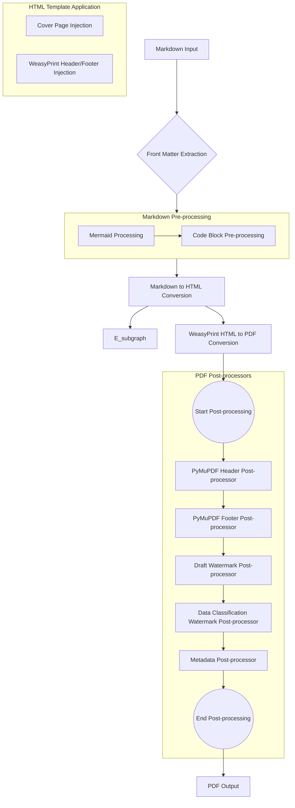

# Markdown to PDF Converter

A Python tool to convert Markdown files to PDF with advanced styling, including CSS-driven theming, headers/footers, page numbering, and Mermaid.js diagram conversion. This tool is specifically designed for **document as code** and **diagram as code** users, aiming for compatibility with document repositories and platforms like Confluence.

## Features

- Convert Markdown to PDF
- CSS-driven styling
- Custom headers and footers with page numbering
- Automatic Table of Contents generation: Generates a clickable Table of Contents with indentation per header level, placed on an independent page with a "Table of Content" title.
- Code syntax highlighting with Confluence-like titles and line numbers
- Mermaid.js diagram conversion to images

## Installation

```bash
pip install md-export-pdf
```

**Note:** For Mermaid.js diagram conversion, you also need to install `mermaid.cli` (mmdc) via npm:
```bash
npm install -g @mermaid-js/mermaid-cli
```

## Usage

```bash
md-export-pdf <input_file.md> -o <output_file.pdf> -s <style.css> \
  [--header "My Document" | --header-file <header.md/html>] [--header-css <header.css>] \
  [--footer "Page {page_num} of {total_pages}" | --footer-file <footer.md/html>] [--footer-css <footer.css>] \
  [--cover-page <cover_page.md>] [--cover-css <cover.css>] \
  [--use-pymupdf-header] [--use-pymupdf-footer]
```

**Note on Headers/Footers:** By default, WeasyPrint handles header and footer generation. If `--use-pymupdf-header` and/or `--use-pymupdf-footer` are used, PyMuPDF will be used for the respective element(s). When using PyMuPDF, only plain text content is supported; Markdown formatting will not be rendered.


## Pluggable PDF Post-processing

This project implements a pluggable system for PDF post-processing, allowing for flexible modifications to the generated PDF after the initial conversion by WeasyPrint. This system is built around the `PdfPostProcessor` abstract base class, which defines a standard interface for applying modifications.

-   **`PyMuPdfHeaderPostProcessor`**: This is a concrete implementation that leverages PyMuPDF for adding headers. It is used when `--use-pymupdf-header` is enabled.
-   **`PyMuPdfFooterPostProcessor`**: This is a concrete implementation that leverages PyMuPDF for adding footers. It is used when `--use-pymupdf-footer` is enabled.
-   **`DummyPostProcessor`**: A simple implementation for testing and validation purposes. It performs no actual modifications but logs its execution. It can be enabled using the `--use-dummy-postprocessor` CLI option.
-   **`DraftWatermarkPostProcessor`**: This post-processor adds a "DRAFT" watermark to each page of the PDF if `draft: true` is present in the Markdown file's front matter.
-   **`DataClassificationWatermarkPostProcessor`**: This post-processor adds a data classification watermark (CONFIDENTIAL, RESTRICTED, or SECRET) in red to each page of the PDF if `data_classification` is specified in the Markdown file's front matter.
-   **Metadata from Front Matter**: The converter now extracts `metadata` from the YAML front matter and applies it to the generated PDF's metadata properties. This allows for programmatic control over PDF metadata like author, title, etc. PyMuPDF only supports the following keys: `author`, `title`, `subject`, `keywords`, `creator`, `producer`, `creationDate`, `modDate`.

This modular design allows for easy integration of new PDF manipulation functionalities or alternative libraries in the future.

### Processing Flowchart



## Development

To set up the development environment:

```bash
git clone <repository_url>
cd md-export-pdf
pip install -e .
```

