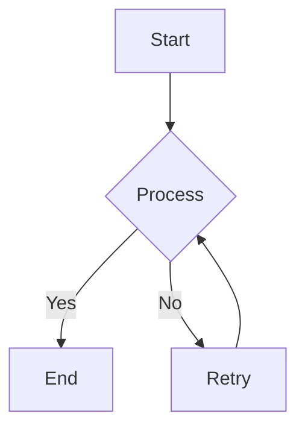

# My Example Document

This is a sample Markdown document to demonstrate the `markdown-to-pdf` converter.

## Features Demonstrated

- **Bold** and *italic* text.
- Lists:
    - Item 1
    - Item 2
- Code block with syntax highlighting:

```python {title="Hello World Example" linenums="true"}
def hello():
    print("Hello, PDF!")
    x = 1 + 2
    print(f"Result: {x}")
```

- Mermaid.js diagram:



This document will be converted to a PDF with a custom header and footer, and styled using a CSS file.

## Sample Table

| Header 1 | Header 2 | Header 3 |
|----------|----------|----------|
| Row 1 Col 1 | Row 1 Col 2 | Row 1 Col 3 |
| Row 2 Col 1 | Row 2 Col 2 | Row 2 Col 3 |