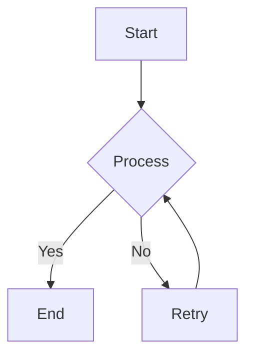

# My Example Document

This is a sample Markdown document to demonstrate the `markdown-to-pdf` converter.

## Features Demonstrated

- **Bold** and *italic* text.
- Lists:
    - Item 1
    - Item 2
- Code block with syntax highlighting:

```python title="Hello World Example" linenums="true"
def hello():
    print("Hello, PDF!")
    x = 1 + 2
    print(f"Result: {x}")
```

- Mermaid.js diagram:



This document will be converted to a PDF with a custom header and footer, and styled using a CSS file.

### More Markdown Elements

Here's a simple paragraph to demonstrate basic text. You can use **bold**, *italic*, and even ***bold and italic*** text.

> This is a blockquote. It can span multiple lines and is often used for citations or emphasized text.
> - Item 1
> - Item 2

---

#### A Sample Table

| A | B |
|---|---|
| 1 | 2 |
| 3 | 4 |

#### Image and Link

Here's an example of an image (using a placeholder):


And a link to [Google](https://www.google.com).

